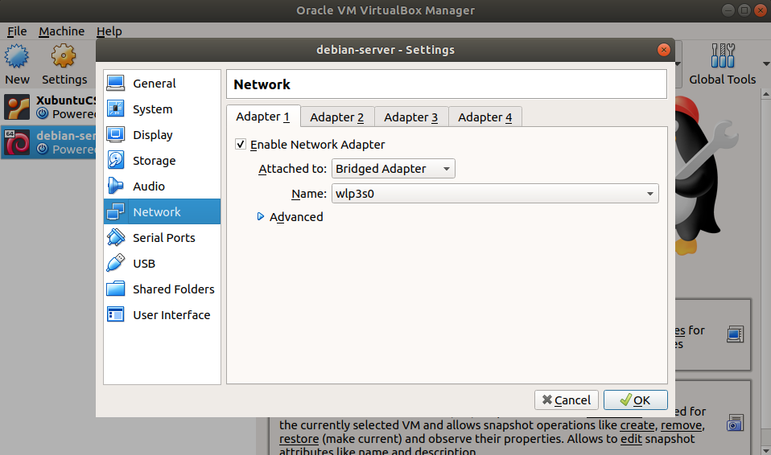

```{r setup, include=FALSE}
knitr::opts_chunk$set(echo = TRUE)
```

## Notas antes de iniciar sesión

Los comandos y ejercicios los podemos ir ejecutando en la
máquina virtual Debian que hemos creado. Para esto debemos de
conectarnos primero a la máquina. Los siguientes pasos son
para realizarlo:

 1. Configuración de la red de la máquina: Debe de estar
 habilitado el adaptador de red con la opción **Bridged Adapter**

<center>

</center>
</br>

 2. Al iniciar la máquina nos debemos de logear. No es necesario hacerlo
 como root. Buscamos el IP con  `ip addr`. Nos dará como respuesta la
 información del IP.
 3. Tomamos la dirección IP, en el caso anterior sería **192.168.100.3**.
 Abrimos una terminal y ahí colocamos el comando
 `ssh -l ronny-hernandez 103.212.222.155`
 4. Esto nos abrirá la conexión a la máquina virtual, nos pedirá una
 contraseña que será la misma que usamos para entrar como usuario a 
 nuestra máquina virtual.
 5. Para salir basta con escribir `exit` en la terminal.
 
## Rol del administrador

## Conceptos generales OS Linux

## Componentes de una distribución

## Sistema de archivos

## Comandos básicos

## Administración de comandos GNU/Linux

### Para apagar el sistema inmediatamente

```{bash, eval = FALSE}
shutdown -h now
```

### Muestra versión del sistema operativo:
```{bash}
# Con comando
lsb_release -a
```


```{bash}
# A partir de archivo de sistema
cat /etc/*-release
```

### Para mostrar nombre de la máquina

```{bash}
# Con comando
hostnamectl
```

```{bash}
# Desde archivo
cat /etc/hostname
```

### Para mostrar información de interfaces de red

Para revisar el **IP del servidor, tarjeta de red e interfaces**
```{bash}
ip addr
```


```{bash}
ip link
```

Da por donde está saliendo la comunicación (**dirección del router**)
```{bash}
ip route
```

Para ver los **nodos vecinos**
```{bash}
ip n
```

Para revisar **cantidad de paquetes enviados y recibidos**
```{bash}
ip -s link 
```

### Servicios (inicio, apagado, reinicio)

**Reiniciar** servicio
```{bash, eval = FALSE}
sudo systemctl restart apache2.service
```

**Estado** del servicio
```{bash, eval = FALSE}
sudo systemctl status apache2.service
```

**Detener** el servicio
```{bash, eval = FALSE}
sudo systemctl stop apache2.service
```

**Iniciar** el servicio
```{bash, eval = FALSE}
sudo systemctl start apache2.service
```

### Servicios de apagado

Apagado de **inmediato**
```{bash, eval = FALSE}
sudo shutdown -h now
```

Apagado **programado con mensaje**. (En 10 min se apaga y envía msj a
usuarios que están trabajando en el servidor)
```{bash, eval = FALSE}
sudo shutdown -h 10 "Vamos a apagar el servidor"
```

Apagado **programado en hora exacta**
```{bash, eval = FALSE}
sudo shutdown -h 23:00
```

**Reinicio del servidor de inmediato**
```{r, engine = `bash`, eval = FALSE}
sudo shutdown -r now
```

Para cambiar configuración de la zona horaria del servidor, primero
podemos buscar la lista de opciones que se encuentran disponibles
```{bash, eval = FALSE}
timedatectl list-timezones
```

Luego, ya que hemos visto la de nuestro interés usamos
```{bash, eval = FALSE}
timedatectl set-timezone America/Costa_Rica
```

